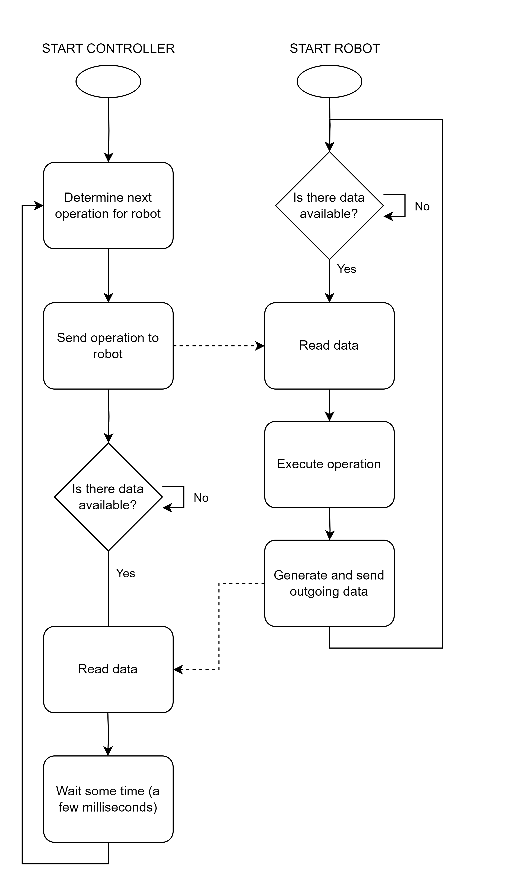

# EPO-2

This is a repo for EPO-2 project, learn git and upload stuff here. Simulations for LT-Spice should also be here.

# Communication between the robot and the controller

This section contains the technical description of how communication between the robot (controlled by the FSM created
by the VHDL team) and the controller (an application written in the C programming language running on a desktop) is
done.

## Send data or receive data?

This section describes when to read or receive data from the perspective of the robot. This means that data sent by the
robot to the desktop will be referred to as 'outgoing data' and data sent by the controller to the robot will be 
referred to as 'incoming data'.

The following flowchart described when both the robot and the control should send byte and when they should expect to
receive a byte.

Both the controller and robot have to send one byte and receive one byte per cycle. The controller is the entity that
sends the first byte. For every byte sent by the controller, exactly one byte should be sent back to the controller.

## Incoming data

This section described the format of the incoming data byte. This byte is sent by the controller to the robot.

Only the three least significant bits (bits 2, 1 and 0) contain data. The remaining five bits always have the value 
'0'. The three bits that actually contain data represent the opcode of the operation that the robot should execute.
All possible combinations of these bits with the corresponding operations are listed in the table below.

| operation       | opcode | meaning                                                                     |
|-----------------|--------|-----------------------------------------------------------------------------|
| `ROBOT_NOOP`    | 000    | The robot should keep doing what it was already doing.                      |
| `ROBOT_LEFT`    | 001    | The robot should start rotating to the left.                                |
| `ROBOT_RIGHT`   | 010    | The robot should start moving to the right.                                 |
| `ROBOT_FORWARD` | 011    | The robot should start moving forward.                                      |
| `ROBOT_STOP`    | 100    | The robot should stop rotating or moving forward. It should come to a stop. |
| -               | 101    | Illicit opcode.                                                             |
| -               | 110    | Illicit opcode.                                                             |
| -               | 111    | Illicit opcode.                                                             |

### Operation priority

The robot may assume that after a `ROBOT_LEFT`, `ROBOT_RIGHT` or a `ROBOT_FORWARD` has been sent, the next operation
that is not `ROBOT_NOOP` will always be `ROBOT_STOP`. 

In other words, the robot is assumed to always be in a state of not doing anything when `ROBOT_LEFT`, `ROBOT_RIGHT` 
or `ROBOT_FORWARD` is sent as operation.  

## Outgoing data

This section describes the format of the outgoing data byte. This is the byte that is sent by the robot to the
controller. This byte is to be sent exactly once after each time an incoming data byte is read.

Each bit in the outgoing data byte indicates a piece of data. The meaning of each bit is described in the table below.

| bit no. | name            | meaning                                                                             |
|---------|-----------------|-------------------------------------------------------------------------------------|
| 7 (MSB) | `rotatingLeft`  | Should equal '1' if the robot is currently rotating to the left, '0' otherwise.     |
| 6       | `rotatingRight` | Should equal '1' if the robot is currently rotating to the right, '0' otherwise.    |
| 5       | `isDriving`     | Should equal '1' if the robot is currently rotating or the robot is moving forward. |
| 4       | `sensorLeft`    | Should equal the value outputted by the left line sensor.                           |
| 3       | `sensorMiddle`  | Should equal the value outputted by the middle line sensor.                         |
| 2       | `sensorRight`   | Should equal the value outputted by the right line sensor.                          |
| 1       | `mineDetected`  | Should equal '1' if the robot is currently detecting a mine, '0' otherwise.         |
| 0 (LSB) | `readBit`       | Should equal '1' if the data contained within the rest of the byte is to be read.   |

### Sensor data

Bits 4, 3 and 2 contain the left, middle and right line sensor values, respectively. The controller interprets the
meaning of the values of these bits as follows.

If such a bit has value '0', the controller assumes that the corresponding sensor is currently detecting a line. If
such a bit has value '1', the controller assumes that no line is detected.

### The `readBit`

If it always desired for the controller to read the byte that was sent by the robot (this is the behaviour that I
think is desired), this bit should always equal '1'.

